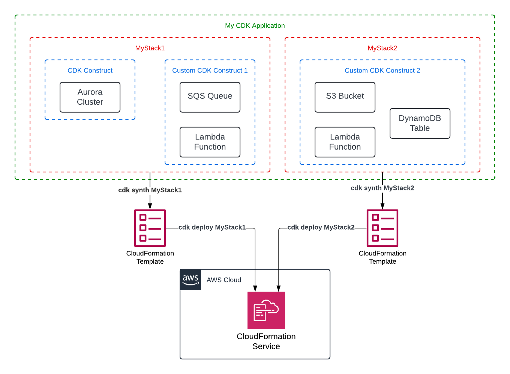
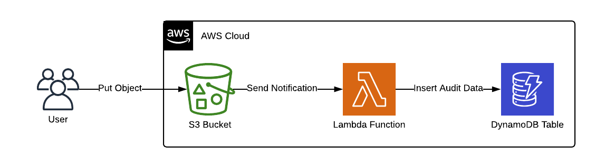
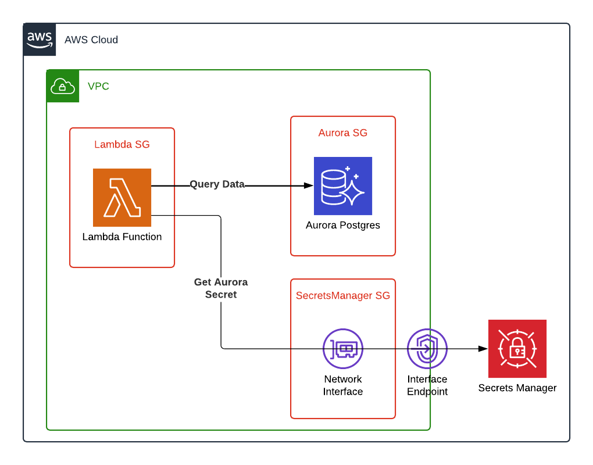

# AWS CDK - Crash Course

## Prerequisites

Basic AWS and CloudFormation knowledge is recommended.

## Intro

AWS Cloud Development Kit (CDK) is an open source framework for defining cloud infrastructure as code. Its main purpose is to model and provision AWS resources using a high level programming language (Python, Java, JavaScript, Golang).

AWS CDK aims to create repeatable and reusable infrastructure by enabling developers to create and manage AWS resources more efficiently and with less boilerplate code compared to traditional configuration files like AWS CloudFormation (for which you need to learn a new syntax and work with no abstractions).

AWS CDK has two components:

- **CDK Toolkit**: a command line tool for interacting with the CDK applications.
- **CDK Construct Library**: is a collection of constructs that are developed and maintained by AWS. It is organized into various modules that contain constructs representing all of the resources available on AWS.

By using common high level programming languages, CDK offers the possibility of a more dynamic deployment environment. For example, you can use a library native to the chosen programming language to fetch a set of files from the Internet and then use CDK to upload those images to an S3 bucket, all within the same runtime.

Another feature of CDK is the ability to propose modifications of the resulting CloudFormation templates based on sensible default settings and best practices.

Examples of this behavior:

- a Lambda function requires an IAM Role to be able to connect to other various AWS Services. If the developer doesn’t explicitly add an IAM Role to be used, CDK will propose to add a Role as part of the deployment procedure.
- an S3 Bucket cannot be deleted unless all the objects stored are deleted first. Using a single parameter set in the S3 Bucket CDK parameters, CDK will build a custom Lambda function and set all the required permissions for the S3 Bucket to be emptied when a bucket deletion is requested.

## Key Concepts

The image below shows the relationship between the main CDK building blocks.



A **CDK Application** is a collection of one or more CDK Stacks. The App class doesn’t configure any AWS service by itself but is used to provide a context to the other components.

A **CDK Stack** is a collection of one or more constructs which define AWS resources. Each CDK Stack is equivalent to an AWS CloudFormation stack. At deploy time, all the components of a CDK Stack will be provisioned as a single CloudFormation stack. Just as the CDK Application, the Stack class doesn’t configure any AWS service. A Stack can reference Constructs and Resources defined in other Stacks within the same Application.

**CDK Constructs** are the basic building blocks of any CDK Application. A Construct is a component that represents one or more CloudFormation resources and their configuration. Constructs are categorized into three levels. Each level offers an increasing level of abstraction. The higher the abstraction, the easier to configure, requiring less expertise. The lower the abstraction, the more customizations available, requiring more expertise.

**Level 1 Constructs** - also known as CFN resources, are the lowest-level construct and offer no abstraction. Each L1 construct maps directly to a single AWS CloudFormation resource. With L1 constructs, you import a construct that represents a specific AWS CloudFormation resource. You then define the resource’s properties within your construct instance. In the AWS Construct Library, L1 constructs are named starting with Cfn, followed by an identifier for the AWS CloudFormation resource that it represents. Examples:

- [CfnOutput](https://docs.aws.amazon.com/cdk/api/v2/docs/aws-cdk-lib.CfnOutput.html) - declares output values that can be imported into other stacks.
- [CfnBucket](https://docs.aws.amazon.com/cdk/api/v2/docs/aws-cdk-lib.aws_s3.CfnBucket.html) - represents an AWS::S3::Bucket AWS CloudFormation resource.

**Level 2 Constructs** - also known as curated constructs, are developed by the CDK team and are usually the most widely used construct type. L2 constructs map directly to single AWS CloudFormation resources, similar to L1 constructs. L2 constructs include sensible default property configurations, best practice security policies, and generate a lot of the boilerplate code and glue logic. L2 constructs also provide helper methods for most resources that make it simpler and quicker to define properties, permissions, event-based interactions between resources, and more. Examples:

- [dynamodb.Table](https://docs.aws.amazon.com/cdk/api/v2/docs/aws-cdk-lib.aws_dynamodb.Table.html) - create a DynamoDB Table.
- [s3.Bucket](https://docs.aws.amazon.com/cdk/api/v2/docs/aws-cdk-lib.aws_s3.Bucket.html) - create an S3 Bucket with the ability of deleting all the objects before bucket deletion.

**Level 3 Constructs** - also known as patterns, are the highest-level of abstraction. Each L3 construct can contain a collection of resources that are configured to work together to accomplish a specific task or service within your application. L3 constructs are used to create entire AWS architectures for particular use cases in your application. To provide complete system designs, or substantial parts of a larger system, L3 constructs offer opinionated default property configurations. They are built around a particular approach toward solving a problem and providing a solution. Examples:

- [HttpsRedirect](https://docs.aws.amazon.com/cdk/api/v2/docs/aws-cdk-lib.aws_route53_patterns.HttpsRedirect.html) - redirect domain A > domain B.
- [ApplicationLoadBalancedFargateService](https://docs.aws.amazon.com/cdk/api/v2/docs/aws-cdk-lib.aws_ecs_patterns.ApplicationLoadBalancedFargateService.html) - a Fargate ECS cluster with an Application Load Balancer.

**CDK Bootstraping** is the process of preparing an environment for deployment. Bootstrapping provisions resources in your environment such as an S3 bucket for storing files and IAM roles that grant permissions needed to perform deployments. These resources get provisioned in an AWS CloudFormation stack, called the bootstrap stack. It is usually named CDKToolkit.

## Useful CDK Commands

`cdk ls` - list all CDK Stacks defined in the current Application

`cdk diff` - will compare the CDK codebase with what resources were already deployed in the AWS account and will show all the changes.

`cdk synth` - will synthesize the CloudFormation template from the CDK codebase.

`cdk deploy` - will synthesize the CloudFormation template from the CDK codebase and send that template to CloudFormation for execution and resource creation.

`cdk destroy` - will destroy all the resources created by the CloudFormation template.

If the CDK Application uses multiple stacks, either the target Stack name or the --all parameter must be added. Examples:

- `cdk synth MyStack1`
- `cdk deploy MyStack2`
- `cdk destroy --all`

## References

[AWS CDK - Developer Guide](https://docs.aws.amazon.com/cdk/v2/guide/home.html)

[AWS CDK - API Reference](https://docs.aws.amazon.com/cdk/api/v2/docs/aws-construct-library.html)

[AWS CDK Workshop](https://cdkworkshop.com/)

[CDK patterns](https://cdkpatterns.com/)

[AWS Cloud Development Kit (CDK) Crash Course](https://www.youtube.com/watch?v=T-H4nJQyMig)

[AWS CDK Crash Course for Beginners](https://www.youtube.com/watch?v=D4Asp5g4fp8)

## Hands-on

### Requirements

From tooling perspective, the requirements are as follows:

- AWS CLI
- AWS CDK
- NPM
- VSCode
- Docker

```shell
brew install awscli aws-cdk node@20 visual-studio-code
```

### S3 Bucket and objects upload

Create an S3 Bucket and populate it with 5 random Internet images. To gather the images, use a service like [Lorem Picsum](https://picsum.photos/) which can generate random images. Make sure ALL the created resources are tagged with your name and spirit animal. When deleting the Stack there should be no resource left behind.

#### Code Example

Example of a full implementation can be found [here](./s3-create-and-upload-app/).

<details>
<summary>Expand</summary>

- Create a new CDK project and open in VSCode

```shell
mkdir s3-create-and-upload-app
cd s3-create-and-upload-app
cdk init app --language typescript
code .
```

- Edit the `./bin/s3-create-and-upload-app.ts` file and add the tags properties to the Stack constructor

```typescript
new S3CreateAndUploadAppStack(app, "S3CreateAndUploadAppStack", {
  tags: {
    Adrian: "Komrade Kat",
  },
});
```

- Edit the `./lib/s3-create-and-upload-app-stack.ts` file and add an import for the aws-cdk S3 constructs library

```typescript
import * as s3 from "aws-cdk-lib/aws-s3";
```

- Edit the `./lib/s3-create-and-upload-app-stack.ts` and create a new [S3 Bucket](https://docs.aws.amazon.com/cdk/api/v2/docs/aws-cdk-lib.aws_s3.Bucket.html)

```typescript
// create an S3 Bucket
const myS3Bucket = new s3.Bucket(this, "downloaded-images-s3-bucket", {
  // set the context for the Stack
  bucketName: "downloaded-images-s3-bucket", // set the Bucket name
  removalPolicy: cdk.RemovalPolicy.DESTROY, // forces the Bucket to be destroyed when the Stack gets deleted
  autoDeleteObjects: true, // creates a Lambda function to empty the Bucket before deletion
});
```

- In the terminal, running `cdk synth` should not yield any errors. You can check the resulting CloudFormation template to identify the resources that will be created

- Edit the `./lib/s3-create-and-upload-app-stack.ts` and add the following imports

```typescript
import * as s3 from "aws-cdk-lib/aws-s3";
import * as s3deploy from "aws-cdk-lib/aws-s3-deployment";
import * as fs from "fs";
import * as https from "https";
```

- To upload the random images to S3, they first need to be downloaded in a local folder

```typescript
// create a temp folder to store the downloaded images
const imagesFolderName = "downloaded-images";
if (!fs.existsSync(imagesFolderName)) {
  fs.mkdirSync(imagesFolderName);
}

// download 5 files from https://picsum.photos/ to the temp folder
for (let i = 0; i < 5; i++) {
  const imageUrl = `https://picsum.photos/id/${i}/500/500`;
  const imageName = `${imagesFolderName}/image-${i}.jpg`;
  const file = fs.createWriteStream(imageName);
  const request = https.get(imageUrl, (response) => {
    response.pipe(file);
  });
}
```

- Next, using the [BucketDeployment construct](https://docs.aws.amazon.com/cdk/api/v2/docs/aws-cdk-lib.aws_s3_deployment.BucketDeployment.html), upload the images to the S3 bucket

```typescript
// create a new S3 Deployment
new s3deploy.BucketDeployment(this, "deploy-downloaded-images", {
  // set the context for the Stack
  sources: [s3deploy.Source.asset(imagesFolderName)], // set the source folder where the Assets can be found to be uploaded
  destinationBucket: myS3Bucket, // set the destination Bucket
});
```

- When running `cdk deploy`, a new S3 bucket should be created and should have 5 jpg files inside
- Cleanup everything using `cdk destroy`

</details>

#### Lessons Learned

- How create a new CDK application using the CDK CLI
- If you set the tags property at Stack level, all the resources created by the Stack will inherit those tags
- How to create an S3 bucket using the Level 2 CDK construct which offers quality of life features like the autoDeleteObjects property which helps with the empty bucket process just before its deletion
- How to use the power of the chosen high level programming language to add extra functionalities, like downloading random images

### S3 Audit using DynamoDB

Create a DynamoDB Table which will act as an audit data storage. For every upload event happening on a S3 Bucket a Lambda Function should be invoked to process the event and insert the audit data in the DynamoDB Table.

Below is a diagram of how the application is expected to work.



Example of a full implementation can be found [here](./s3-lambda-dynamodb-audit/).

<details>
<summary>Expand</summary>

- Create a new CDK project

```shell
mkdir s3-lambda-dynamodb-audit
cd s3-lambda-dynamodb-audit
cdk init app --language typescript
```

- Create a new folder where the Lambda function code will reside & Open the project in VSCode

```shell
mkdir lambda
code .
```

- Edit the `./lib/s3-lambda-dynamodb-audit-stack.ts` file and create a new [S3 Bucket](https://docs.aws.amazon.com/cdk/api/v2/docs/aws-cdk-lib.aws_s3.Bucket.html)

```typescript
const s3Bucket = new s3.Bucket(this, "audit-items-processing-bucket", {
  bucketName: "audit-items-processing-bucket",
  autoDeleteObjects: true,
  removalPolicy: cdk.RemovalPolicy.DESTROY,
});
```

- Edit the `./lib/s3-lambda-dynamodb-audit-stack.ts` file and create a new [DynamoDB Table](https://docs.aws.amazon.com/cdk/api/v2/docs/aws-cdk-lib.aws_dynamodb.Table.html)

```typescript
const auditDynamoTable = new dynamodb.Table(
  this,
  "audit-processed-items-table",
  {
    tableName: "audit-processed-items-table",
    partitionKey: {
      name: "id",
      type: dynamodb.AttributeType.STRING,
    },
  }
);
```

- Edit the `./lib/s3-lambda-dynamodb-audit-stack.ts` file and create a new [IAM Role](https://docs.aws.amazon.com/cdk/api/v2/docs/aws-cdk-lib.aws_iam.Role.html) to be used by the Lambda function

```typescript
const lambdaRole = new iam.Role(this, "audit-processing-lambda-role", {
  roleName: "audit-processing-lambda-role",
  assumedBy: new iam.ServicePrincipal("lambda.amazonaws.com"),
});
```

- Add the Default Lambda execution permissions to the IAM Role

```typescript
lambdaRole.addManagedPolicy(
  iam.ManagedPolicy.fromAwsManagedPolicyName(
    "service-role/AWSLambdaBasicExecutionRole"
  )
);
```

- Add permissions to the IAM Role to write to the DynamoDB Table

```typescript
auditDynamoTable.grantWriteData(lambdaRole);
```

- Edit the `./lib/s3-lambda-dynamodb-audit-stack.ts` file and create a new [NodejsFunction](https://docs.aws.amazon.com/cdk/api/v2/docs/aws-cdk-lib.aws_lambda_nodejs.NodejsFunction.html)

```typescript
const processingLambda = new nodeLambda.NodejsFunction(
  this,
  "audit-processing-lambda-function",
  {
    functionName: "audit-processing-lambda-function",
    role: lambdaRole,
    runtime: lambda.Runtime.NODEJS_20_X,
    handler: "handler",
    entry: "./lambda/main.ts",
    environment: {
      AUDIT_TABLE_NAME: auditDynamoTable.tableName,
    },
  }
);
```

- Add an [Event Source to the Lambda function](https://docs.aws.amazon.com/cdk/api/v2/docs/aws-cdk-lib.aws_lambda_nodejs.NodejsFunction.html#addwbreventwbrsourcesource) to be triggered when an S3 object is created in the bucket created earlier

```typescript
processingLambda.addEventSource(
  new lambdasource.S3EventSource(s3Bucket, {
    events: [s3.EventType.OBJECT_CREATED],
  })
);
```

- Install the [DynamoDB Client](https://docs.aws.amazon.com/AWSJavaScriptSDK/v3/latest/client/dynamodb/)

```shell
npm install @aws-sdk/client-dynamodb
```

- Create a new empty file under the `lambda` folder created earlier named `main.ts`
- Edit the` ./lambda/main.ts` file and create a new DynamoDB client

```typescript
const dynamodbClient = new DynamoDBClient();
```

- Edit the `./lambda/main.ts` file and get the value of `AUDIT_TABLE_NAME` from the environment variables

```typescript
const auditTableName = process.env.AUDIT_TABLE_NAME;
```

- Create a Lambda handler function that will print the invoking event

```typescript
export const handler: Handler = async (
  event: any,
  context: any
): Promise<any> => {
  // print the invoking event
  console.log(event);
};
```

- For each record from the invoking event [Put an item](https://docs.aws.amazon.com/AWSJavaScriptSDK/v3/latest/client/dynamodb/command/PutItemCommand/) in the DynamoDB Table

```typescript
for (const record of event["Records"]) {
  console.log(record);

  // create the template for the Item
  const putCommand = new PutItemCommand({
    TableName: auditTableName,
    Item: {
      id: {
        S: randomUUID(),
      },
      eventName: {
        S: record["eventName"],
      },
      timestamp: {
        N: Date.now().toString(),
      },
      object_key: {
        S: record["s3"]["object"]["key"],
      },
      object_etag: {
        S: record["s3"]["object"]["eTag"],
      },
    },
  });
}
```

- Inside the for loop execute the Put Command using the DynamoDB Client

```typescript
dynamodbClient.send(putCommand);
```

- When running `cdk deploy`, a new S3 bucket, Lambda function and DynamoDB table should be created. Navigate to the Lambda function console and there should be an S3 trigger configured with the details of your bucket
- To test the end-to-end functionality, upload one or more files in the S3 bucket and check if there are new entries in the DynamoDB Table
- Cleanup everything using `cdk destroy`

</details>

#### Lessons Learned

- How to create an S3 bucket, a DynamoDB Table and a Lambda function using Level 2 CDK constructs
- How to add an AWS managed policy to an IAM Role
- How to allow access between resources using the grant function offered by the Level 2 constructs
- How to create a Lambda function. The use of the NodejsFunction construct enables you to write the Lambda function code in Typescript and, at deploy time, that code will be automatically compiled to JavaScript
- How to add an S3 event as a trigger for a Lambda function
- How to use the AWS SDK for JavaScript version 3 to enable the communication between the Lambda function code and other AWS services

### First VPC Resources

Create a Lambda function that will execute a SQL insert into a AWS Aurora Postgres database running the Postgres engine. The database already exists and you only need to connect to it and execute SQL statements. To access the database, use the credentials stored in a Secrets Manager secret which were already created.

The function ca receive three types of events:

`state='reset'` the function should drop the database table are re-create it from a local SQL file.

`state='insert'` the function should insert the content of the message into the database.

`state='all'` the function should return all the entries stored in the database.

If the `ENV_NAME` variable is set to `PROD`, all resources names should be prefixed by the `rudolf` string. Otherwise, the prefix should be `mushroom`.

Below is a diagram of how the application is expected to work.



Example of a full implementation can be found [here](./first-vpc-resources/).

<details>
<summary>Expand</summary>

- Create a new CDK project

```shell
mkdir s3-lambda-dynamodb-audit
cd s3-lambda-dynamodb-audit
cdk init app --language typescript
```

- Create a new folder where the Lambda function code will reside & Open the project in VSCode

```shell
mkdir lambda
code .
```

- Edit the `./bin/first-vpc-resources.ts` file and read the `ENV_NAME`, `VPC_ID`, `RDS_SECRET_ARN`, `SM_SECURITY_GROUP_ID` variables

```typescript
const envName = process.env.ENV_NAME;
const vpcId = process.env.VPC_ID;
const rdsSecretArn = process.env.RDS_SECRET_ARN;
const smSecurityGroupId = process.env.SM_SECURITY_GROUP_ID;
```

- Edit the `./bin/first-vpc-resources.ts` file and set the prefix value based on the `ENV_NAME` variable

```typescript
var namePrefix = "";
if (envName === "PROD") {
  namePrefix = "rudolf";
} else {
  namePrefix = "mushroom";
}
```

- Edit the `./bin/first-vpc-resources.ts` file and pass the prefix and the rest of the environment variables to the stack

```typescript
new FirstVpcResourcesStack(app, "FirstVpcResourcesStack", {
  env: { account: "671092559308", region: "us-east-1" },
  tags: {
    Environment: envName,
  },
  vpcId: vpcId,
  rdsSecretArn: rdsSecretArn,
  smSecurityGroupId: smSecurityGroupId,
  namePrefix: namePrefix,
});
```

- Edit the `./lib/first-vpc-resources-stack.ts` file and create a new interface that extends the `cdk.StackProps` interface. The new interface should define the non standard parameters to be sent to the Stack

```typescript
interface FirstVpcResourcesStackProps extends cdk.StackProps {
  vpcId: string;
  rdsSecretArn: string;
  namePrefix: string;
  smSecurityGroupId: string;
}
```

- Edit the `./lib/first-vpc-resources-stack.ts` file and instruct the Stack constructor to use the newly created interface

```typescript
constructor(scope: Construct, id: string, props: FirstVpcResourcesStackProps)
```

- Edit the `./lib/first-vpc-resources-stack.ts` file and create an [IAM Role](https://docs.aws.amazon.com/cdk/api/v2/docs/aws-cdk-lib.aws_iam.Role.html) to be used by the Lambda function and assign Basic execution permissions and VPC permissions

```typescript
const lambdaRole = new iam.Role(this, lambdaRoleName, {
  roleName: lambdaRoleName,
  assumedBy: new iam.ServicePrincipal("lambda.amazonaws.com"),
});

// add basic permissions
lambdaRole.addManagedPolicy(
  iam.ManagedPolicy.fromAwsManagedPolicyName(
    "service-role/AWSLambdaBasicExecutionRole"
  )
);
lambdaRole.addManagedPolicy(
  iam.ManagedPolicy.fromAwsManagedPolicyName(
    "service-role/AWSLambdaVPCAccessExecutionRole"
  )
);
```

- Create a [VPC resource](https://docs.aws.amazon.com/cdk/api/v2/docs/aws-cdk-lib.aws_ec2.Vpc.html#static-fromwbrlookupscope-id-options) by looking up the VPC ID that was passed to the Stack

```typescript
const vpc = ec2.Vpc.fromLookup(this, "existing-vpc", {
  vpcId: props.vpcId,
});
```

- Create a new [SecurityGroup](https://docs.aws.amazon.com/cdk/api/v2/docs/aws-cdk-lib.aws_ec2.SecurityGroup.html) for the Lambda function and add outbound rules to ports 5432 and 443

```typescript
const lambdaSecurityGroup = new ec2.SecurityGroup(this, lambdaFunctionSGName, {
  securityGroupName: lambdaFunctionSGName,
  vpc: vpc,
  allowAllOutbound: false,
  disableInlineRules: true,
});

lambdaSecurityGroup.addEgressRule(ec2.Peer.anyIpv4(), ec2.Port.tcp(5432));
lambdaSecurityGroup.addEgressRule(ec2.Peer.anyIpv4(), ec2.Port.tcp(443));
```

- Create a Secret resource by looking up the [RDS Secret](https://docs.aws.amazon.com/cdk/api/v2/docs/aws-cdk-lib.aws_secretsmanager.Secret.html#static-fromwbrsecretwbrcompletewbrarnscope-id-secretcompletearn) ARN that was passed to the Stack and grant read permissions to the Lambda IAM Role

```typescript
const rdsSecret = sm.Secret.fromSecretCompleteArn(
  this,
  "rds-secret",
  props.rdsSecretArn
);

rdsSecret.grantRead(lambdaRole);
```

- Create a [SecurityGroup](https://docs.aws.amazon.com/cdk/api/v2/docs/aws-cdk-lib.aws_ec2.SecurityGroup.html) resource by looking up the Secrets Manager [SecurityGroup ID](https://docs.aws.amazon.com/cdk/api/v2/docs/aws-cdk-lib.aws_ec2.SecurityGroup.html#static-fromwbrsecuritywbrgroupwbridscope-id-securitygroupid-options)

```typescript
const smEndpointSG = ec2.SecurityGroup.fromSecurityGroupId(
  this,
  "sm-endpoint-sg",
  props.smSecurityGroupId
);
```

- Create a [NodejsFunction](https://docs.aws.amazon.com/cdk/api/v2/docs/aws-cdk-lib.aws_lambda_nodejs.NodejsFunction.html) which will be deployed in the existing VPC and attach the IAM Role, Lambda SG, SecretsManager SG, pass the SECRET_ARN as environment variable and bundle the pg node package and the create.sql file

```typescript
const myLambda = new lambdanode.NodejsFunction(this, lambdaFunctionName, {
  functionName: lambdaFunctionName,
  runtime: lambda.Runtime.NODEJS_20_X,
  handler: "lambda_handler",
  entry: "lambda/function.ts",
  role: lambdaRole,
  securityGroups: [lambdaSecurityGroup, smEndpointSG],
  vpc: vpc,
  vpcSubnets: {
    subnetType: ec2.SubnetType.PRIVATE_ISOLATED,
    onePerAz: true,
  },
  environment: {
    RDS_SECRET_ARN: props.rdsSecretArn,
  },
  bundling: {
    commandHooks: {
      afterBundling: (inputDir: string, outputDir: string): string[] => [
        `cp ${inputDir}/lambda/create.sql ${outputDir}`,
      ],
      beforeBundling: (inputDir: string, outputDir: string): string[] => [],
      beforeInstall: (inputDir: string, outputDir: string): string[] => [],
    },
    nodeModules: ["pg"],
  },
});
```

- Install the [SecretsManager Client](https://docs.aws.amazon.com/AWSJavaScriptSDK/v3/latest/client/secrets-manager/) and the postgres DB driver

```shell
npm install @aws-sdk/client-secrets-manager pg
```

- Create two new empty files under the lambda folder created earlier named `function.ts` and `create.sql`
- Edit the `./lambda/create.sql` file and add a create table SQL instruction

```sql
CREATE TABLE IF NOT EXISTS animals (
    animal_id uuid DEFAULT gen_random_uuid(),
    name VARCHAR NOT NULL,
    color VARCHAR NOT NULL,
    PRIMARY KEY (animal_id)
);
```

- Edit the `./lambda/function.ts` file and get the [RDS secret based on the ARN](https://docs.aws.amazon.com/AWSJavaScriptSDK/v3/latest/client/secrets-manager/command/GetSecretValueCommand/) from the environment variables

```typescript
const secretArn = process.env.RDS_SECRET_ARN;
const response = await smClient.send(
  new GetSecretValueCommand({
    SecretId: secretArn,
  })
);
const secretJSON = JSON.parse(response.SecretString!);
```

- Edit the `./lambda/function.ts` file and create a new [PostgresClient](https://wiki.postgresql.org/wiki/PostgreSQL_Clients) using the data from the Secret

```typescript
const pgClient = new Client({
  host: secretJSON["host"],
  port: secretJSON["port"],
  database: secretJSON["dbname"],
  user: secretJSON["username"],
  password: secretJSON["password"],
});
```

- If the `state` value passed in the Lambda event is `reset`, drop the existing table and re-create it using the `create.sql` file

```typescript
if (state == "reset") {
  // load the create script
  const createScript = fs.readFileSync("create.sql", "utf8");

  await pgClient.query(`DROP TABLE IF EXISTS animals;`);

  await pgClient.query(createScript);

  return {
    reset: "OK",
  };
}
```

- If the `state` value passed in the Lambda event is `insert`

```typescript
if (state == "insert") {
  const res = await pgClient.query(
    `INSERT INTO animals (name, color) VALUES ($1, $2) returning *;`,
    [event["data"]["name"], event["data"]["color"]]
  );

  return {
    insert: res.rows[0],
  };
}
```

- If the `state` value passed in the Lambda event is `all`, return the content of the table

```typescript
if (state == "all") {
  const res = await pgClient.query("SELECT * FROM animals;");

  return {
    all: res.rows,
  };
}
```

- When running `cdk deploy`, the Lambda function should be created as part of the indicated VPC while having access to the RDS database and the RDS Secret.
- Cleanup everything using `cdk destroy`

</details>

#### Lessons Learned

- How to pass custom properties to your CDK Stack
- How to use existing resources by looking them up by their ID or ARN
- How to configure a Lambda function to be deployed within a VPC
- How to configure a VPC bound Lambda function to communicate with other AWS services which are not VPC bound (like Secrets Manager). This is enabled by the addition of the Lambda function inside the Security Group of the VPC Endpoint that was created to forward requests to Secrets Manager.
- How to bundle extra files alongside the Lambda function code
- How to add a dependent library to the deployment package of the Lambda function
